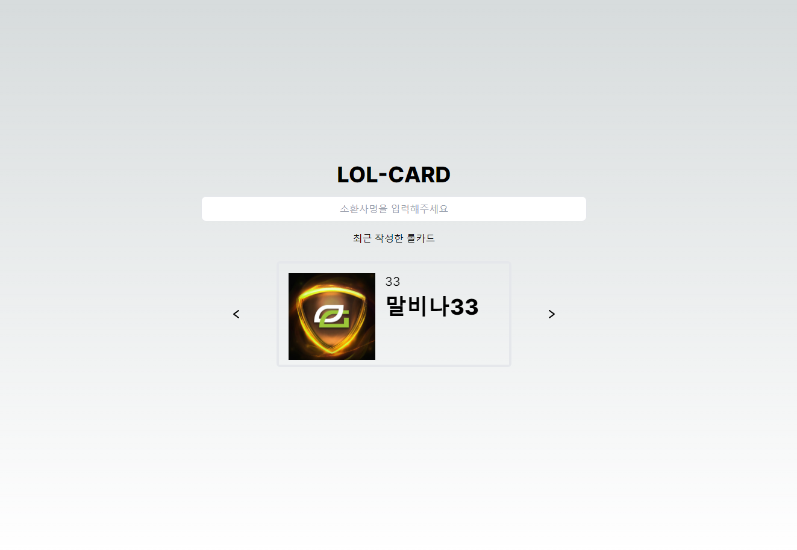
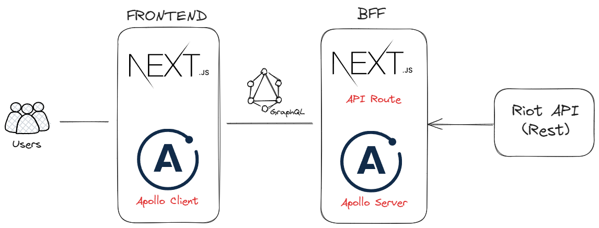

<!-- Improved compatibility of 맨 위로 link: See: https://github.com/othneildrew/Best-README-Template/pull/73 -->

<a name="readme-top"></a>

<!-- PROJECT SHIELDS -->
<!--
*** I'm using markdown "reference style" links for readability.
*** Reference links are enclosed in brackets [ ] instead of parentheses ( ).
*** See the bottom of this document for the declaration of the reference variables
*** for contributors-url, forks-url, etc. This is an optional, concise syntax you may use.
*** https://www.markdownguide.org/basic-syntax/#reference-style-links
-->

<!-- PROJECT LOGO -->
<br />
<div align="center">

  <h3 align="center">LOL-Card</h3>

  <p align="center">
    친구들과 LOL 프로필을 카드화해서 공유해보세요 !
    <br />
    <br />
    <br />
    <a href="#">배포링크가 들어갈 예정입니다.</a>

  </p>
</div>

<!-- TABLE OF CONTENTS -->
<details>
  <summary>Table of Contents</summary>
  <ol>
    <li>
      <a href="#프로젝트-설명">프로젝트 설명</a>
    </li>
    <li>
      <a href="#사용-기술-스택">사용 기술 스택</a>
    </li>
    <li>
      <a href="#프로젝트-설계-및-구조">프로젝트 설계 및 구조</a>
    </li>
    <li>
      <a href="#프로젝트-실행">프로젝트 실행</a>
    </li>
    <li>
      <a href="#로드맵">로드맵</a>
    </li>
        <li>
      <a href="#핵심-기능">핵심기능</a>
    </li>
    <li>
      <a href="#참고-링크들">참고 링크들</a>
    </li>
  </ol>
</details>

<!-- ABOUT THE PROJECT -->

## 프로젝트 설명


(임시 메인페이지 사진)

- 리그오브레전드 게임에서 내 프로필을 카드형식으로 생성해 친구들 혹은 다른 사용자와 공유할 수 있는 서비스 입니다.

- 소환사 명을 검색만하면 누구든지 쉽고 빠르게 자동완성 된 카드를 공유할 수 있고 본인이 커스텀할 수 있도록 서비스를 제공하는게 목표입니다.

<p align="right">(<a href="#readme-top">맨 위로</a>)</p>

### 사용 기술 스택

[![Next][Next.js]][Next-url]
[![React][React.js]][React-url]
[![Graphql][Graphql-shield]][Graphql-url]
[![Apollo][Apollo-shield]][Apollo-url]
[![TailwindCSS][TailwindCSS-shield]][TailwindCSS-url]
[![Redux][Redux-shield]][Redux-url]
[![Vercel][Vercel-shield]][Vercel-url]

<p align="right">(<a href="#readme-top">맨 위로</a>)</p>

## 프로젝트 설계 및 구조



Riot API의 데이터를 가져와서 클라이언트의 요청(graphql)에 맞게 가공해서 제공하는 BFF 구조를 사용했습니다.

Next.js13 버전의 App route 기능을 사용해서 `/api/graphql`를 엔드포인트로 요청할 수 있도록 구현해서 사용했습니다.

이 과정에서 `as-intergation/next` 라이브러리를 추가로 사용했습니다.

프론트부터 구현하기 위해 `graphql-tools`의 `mock`을 사용했습니다.

- 시퀀스 다이어그램 추가 예정

<!-- GETTING STARTED -->

## 프로젝트 실행

1. Clone the repo
   ```sh
   git clone https://github.com/your_username_/Project-Name.git
   ```
2. Install NPM packages
   ```sh
   npm install
   ```
3. Enter your API in `config.js`
   ```js
   const API_KEY = 'ENTER YOUR API';
   ```

<p align="right">(<a href="#readme-top">맨 위로</a>)</p>

<!-- ROADMAP -->

## 로드맵

- [x] Next.JS 프로젝트 파일구조 형성
- [x] graphql-tool/mock 을 사용해 테스트용 Mock 구성
- [x] Next.JS 13의 App route를 사용해 graphql로 클라이언트 요청 처리
- [x] 메인 페이지 구현, TailwindCSS 사용해서 스타일링
  - [x] 최근 생성한 card 를 보여주는 card-title 부분 구현
  - [x] 검색 기능 구현, 검색 한 소환사 명을 /card 페이지에 전달
  - [ ] 반응형(mobile, PC) 고려해서 레이아웃 추가
  - [ ] 코드 리팩토링
    - [x] Redux-toolkit 적용
    - [x] summonerName을 uuid로 접근 하도록 변경
    - [x] 동적 라우팅 적용하기 [Slug] /card/[slug]/page.tsx 으로 접근하도록 적용
    - [ ] Page 컴포넌트에서 SSR 사용하도록 로직 분리
- [x] 카드페이지 구현
  - [x] 완성된 카드로 자동생성 된 카드 구현
  - [x] GSAP라이브러리를 사용해 카드 애니메이션 적용하기
- [ ] 카드 커스텀 페이지 구현
  - [ ] 자동생성 된 완성카드의 데이터가 미리 들어가 있어야 함
- [ ] 카드 공유 기능 구현
  - [ ] 커스텀링크 생성 후 공유하게 될텐데 사용자 편의성 신경쓰기
  - [ ] Open Graph를 잘 추가해서 링크가 SNS에서 보기 쉽게 구현
  - [ ] 카카오톡 or SNS에 공유할 수 있게 구현
        <br>

[![Issues][issues-shield]][issues-url]<br>
계획했던 부분에서 변경사항, 버그 수정은 이슈를 활용하고 있습니다.

<p align="right">(<a href="#readme-top">맨 위로</a>)</p>

<!-- ACKNOWLEDGMENTS -->

## 핵심 기능

1. 소환사 데이터 검색
2. 검색된 데이터로 카드 생성
3. 생성된 카드를 커스텀하는 기능
4. 생성된 카드를 공유하는 기능

## 참고 링크들

- [Choose an Open Source License](https://choosealicense.com)
- [GitHub Emoji Cheat Sheet](https://www.webpagefx.com/tools/emoji-cheat-sheet)
- [Malven's Flexbox Cheatsheet](https://flexbox.malven.co/)
- [Malven's Grid Cheatsheet](https://grid.malven.co/)
- [Img Shields](https://shields.io)
- [GitHub Pages](https://pages.github.com)
- [Font Awesome](https://fontawesome.com)
- [React Icons](https://react-icons.github.io/react-icons/search)

<p align="right">(<a href="#readme-top">맨 위로</a>)</p>

<!-- MARKDOWN LINKS & IMAGES -->
<!-- https://www.markdownguide.org/basic-syntax/#reference-style-links -->

[contributors-shield]: https://img.shields.io/github/contributors/othneildrew/Best-README-Template.svg?style=for-the-badge
[contributors-url]: https://github.com/othneildrew/Best-README-Template/graphs/contributors
[forks-shield]: https://img.shields.io/github/forks/othneildrew/Best-README-Template.svg?style=for-the-badge
[forks-url]: https://github.com/othneildrew/Best-README-Template/network/members
[stars-shield]: https://img.shields.io/github/stars/othneildrew/Best-README-Template.svg?style=for-the-badge
[stars-url]: https://github.com/othneildrew/Best-README-Template/stargazers
[issues-shield]: https://img.shields.io/github/issues/othneildrew/Best-README-Template.svg?style=for-the-badge
[issues-url]: https://github.com/othneildrew/Best-README-Template/issues
[license-shield]: https://img.shields.io/github/license/othneildrew/Best-README-Template.svg?style=for-the-badge
[license-url]: https://github.com/othneildrew/Best-README-Template/blob/master/LICENSE.txt
[linkedin-shield]: https://img.shields.io/badge/-LinkedIn-black.svg?style=for-the-badge&logo=linkedin&colorB=555
[linkedin-url]: https://linkedin.com/in/othneildrew
[product-screenshot]: images/screenshot.png
[Next.js]: https://img.shields.io/badge/next.js-000000?style=for-the-badge&logo=nextdotjs&logoColor=white
[Next-url]: https://nextjs.org/
[React.js]: https://img.shields.io/badge/React-000000?style=for-the-badge&logo=react&logoColor=61DAFB
[React-url]: https://reactjs.org/
[Graphql-shield]: https://img.shields.io/badge/graphql-000000?style=for-the-badge&logo=graphql&logoColor=E10098
[Apollo-shield]: https://img.shields.io/badge/apollographql-000000?style=for-the-badge&logo=apollographql&logoColor=white
[TailwindCSS-shield]: https://img.shields.io/badge/tailwindCSS-000000?style=for-the-badge&logo=tailwindCSS&logoColor=61DAFB
[Redux-shield]: https://img.shields.io/badge/redux-000000?style=for-the-badge&logo=redux&logoColor=61DAFB
[Vercel-shield]: https://img.shields.io/badge/vercel-000000?style=for-the-badge&logo=vercel&logoColor=white
[Husky-shield]: https://img.shields.io/badge/husky-F4E1E1?style=for-the-badge&logo=husky&logoColor=black
[Graphql-url]: https://graphql.org/
[Apollo-url]: https://www.apollographql.com/
[TailwindCSS-url]: https://tailwindcss.com/
[Redux-url]: https://redux.js.org/
[Vercel-url]: https://vercel.com/
